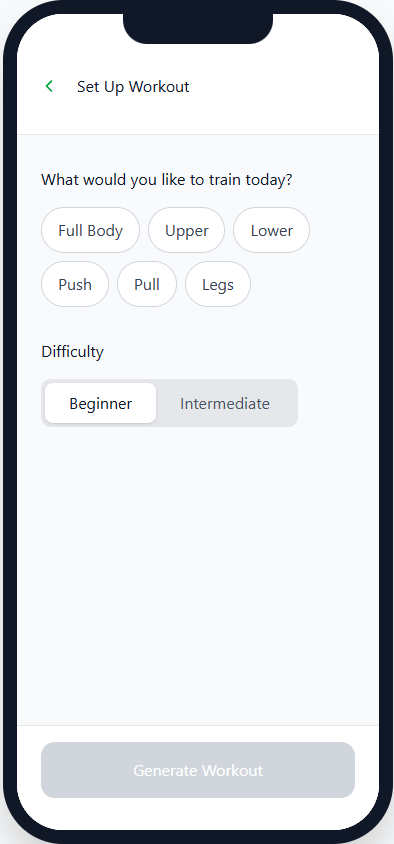
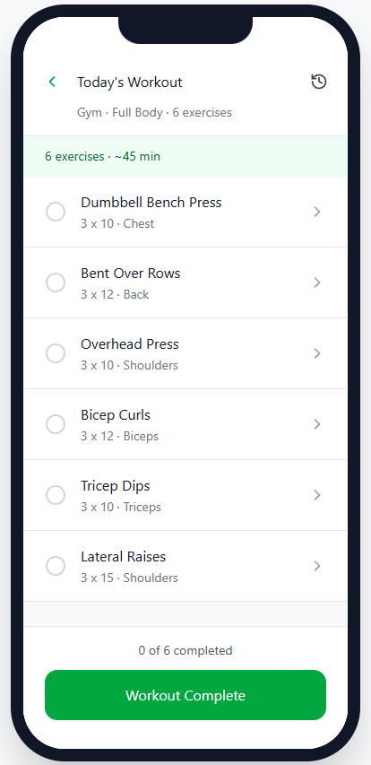
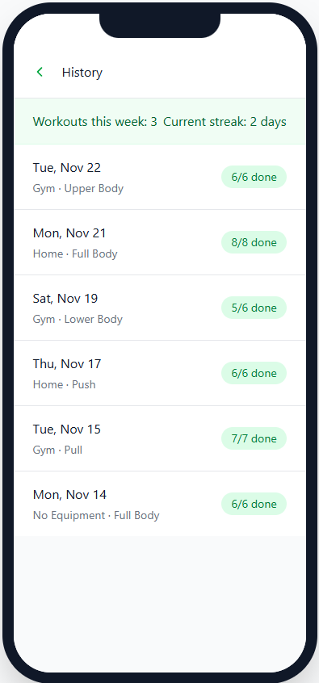
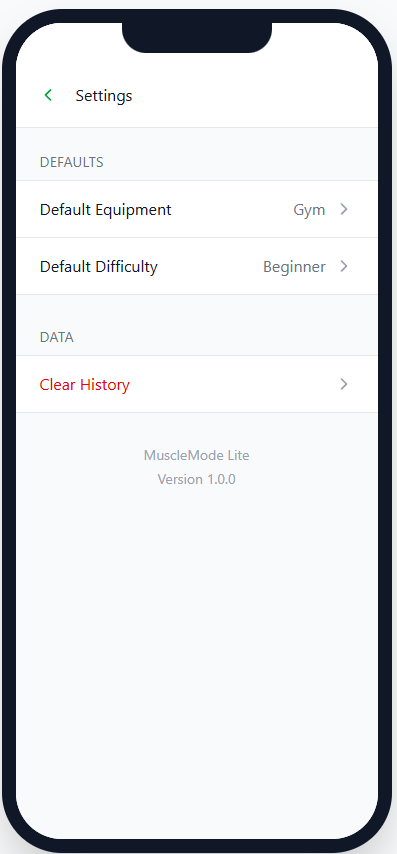

# MuscleMode Lite

## App Overview

### Description

MuscleMode Lite is a simple workout planner that generates daily routines based on the user’s workout focus and equipment access (Gym / Home / No Equipment). Instead of scrolling through random workout videos or notes, users can quickly set up a workout for the day, see a clear list of exercises (with sets and reps), and mark each exercise as completed.

### App Evaluation

- **Category:** Health & Fitness
- **Core Problem:** Beginners and casual lifters often go to the gym or work out at home without a structured routine. This leads to confusion, wasted time, and inconsistent progress.
- **Target Users:** Beginner–intermediate users who want a guided workout plan, especially students or busy people who don’t want to design programs themselves.
- **Why this app is useful:** It reduces decision fatigue by answering “What should I do today?” with a simple generated workout. Users can follow a clear list and slowly build consistency.
- **Scope & Feasibility:** The MVP only needs static or lightly structured exercise data and simple UI flows (select → generate → complete). Advanced features (history, favorites, difficulty levels, videos) can be added as stretch goals in later milestones.

---

## App Spec

### 1. User Features (User Stories)

#### Required (MVP)

- [ ] As a user, I want to **choose my equipment setting** (Gym / Home / No Equipment), so the exercises match what I have access to.
- [ ] As a user, I want to **select my workout focus** (Full Body, Upper, Lower, Push, Pull, Legs), so I can target specific muscle groups.
- [ ] As a user, I want the app to **generate a workout** (list of exercises with sets/reps), so I know exactly what to do today.
- [ ] As a user, I want to **view today’s workout** in one place, so I can easily follow it while exercising.
- [ ] As a user, I want to **mark exercises as completed**, so I can track my progress through the workout.
- [ ] As a user, I want to **see basic exercise details** (name, muscle group, short description), so I have an idea of how to perform each movement.
- [ ] As a user, I want to **see a simple history of recent workouts** (e.g., last few days), so I can remember what I did.

#### Optional / Stretch Features

- [ ] As a user, I want to **set my default equipment** and **difficulty** (Beginner / Intermediate), so I don’t have to reselect it every time.
- [ ] As a user, I want to **save favorite workout templates**, so I can reuse routines I really like.
- [ ] As a user, I want to **edit a generated workout** (remove or swap exercises), so my workout can match my preferences.
- [ ] As a user, I want to **see GIFs or videos** demonstrating exercises, so I can check my form visually.
- [ ] As a user, I want to **track weights or notes** for certain exercises, so I can see my strength progress over time.
- [ ] As a user, I want to **see streaks or small achievement badges**, to stay motivated and consistent.

---

### 2. Screens & Navigation Flows

#### Screens (MVP)

1. **Welcome / Mode Selection Screen**
   - Asks: “Where are you working out today?”
   - Options: Gym, Home, No Equipment.
   - Sets a temporary or default mode for the current session.

2. **Workout Setup Screen**
   - User chooses workout focus:
     - Full Body, Upper, Lower, Push, Pull, Legs (or similar).
   - Optional: Difficulty (Beginner / Intermediate).
   - Button: `Generate Workout`.

3. **Today’s Workout Screen**
   - Displays:
     - Workout summary (e.g., “Gym · Upper Body · 6 exercises”).
     - List of exercises: name, sets x reps, muscle group.
   - Each exercise has:
     - Checkbox/indicator to mark as complete.
     - Tappable row to view exercise details.
   - Bottom: progress (“3/6 completed”) and `Workout Complete` button.

4. **Exercise Detail Screen**
   - Shows:
     - Exercise name.
     - Muscle group and equipment.
     - Sets x reps.
     - Short “How to perform” description.
   - (Stretch) Placeholder or thumbnail for GIF/video.

5. **History Screen**
   - List of recent workouts:
     - Date.
     - Workout type (e.g., “Home · Full Body”).
     - Completion status (e.g., “6/6 done”).
   - Can be reached via a bottom tab or a menu.

6. **Settings Screen (Simple)**
   - Default equipment setting.
   - Default difficulty.
   - Clear history button (optional).

---

#### Navigation Flows

**Primary Flow (MVP):**

1. App Launch → **Welcome / Mode Selection Screen**
2. User selects equipment mode (Gym/Home/No Equipment) → **Workout Setup Screen**
3. User selects workout focus (e.g., Upper) → taps `Generate Workout`
4. App navigates to **Today’s Workout Screen** with a generated exercise list
5. User taps an exercise to see **Exercise Detail Screen**, then returns
6. User checks off exercises as completed
7. User taps `Workout Complete` (optional simple confirmation/end state)

**Other Flows:**

- From **Today’s Workout Screen** → navigate to **History** (via bottom tab or menu).
- From **Today’s Workout Screen** or **History** → navigate to **Settings**.

---

## Wireframes

> Note: Replace the placeholders below with your actual sketches or digital wireframes.

### Screens

1. **Welcome / Mode Selection**
2. **Workout Setup**
3. **Today’s Workout**
4. **Exercise Detail**
5. **History**
6. **Settings** (optional MVP)

### Wireframe Images (to include in repo)

```markdown






